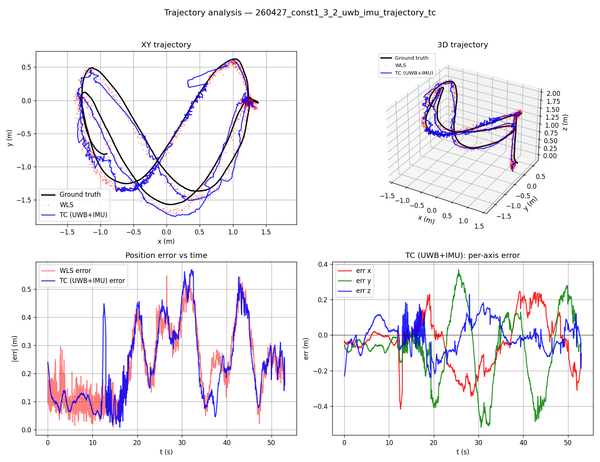
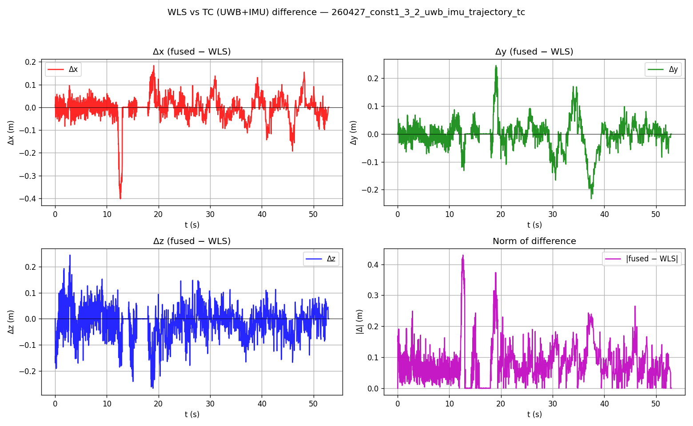

# uwb_imu_fusion

UWB TDOA + IMU sensor fusion using GTSAM factor-graph optimization. The package
ships three flavors:

| Launch file | Node | Description |
|---|---|---|
| `uwb_imu_fusion.launch` | `uwb_imu_fusion_node` | **Tightly-coupled (TC)** TDOA + IMU FGO, with WLS position prior |
| `uwb_lc_fusion.launch` | `uwb_imu_lc_wls_fusion_node` | **Loosely-coupled (LC)** WLS position + IMU FGO |
| `uwb_wls_fusion.launch` | `uwb_wls_fusion_node` | UWB-only WLS baseline |

## Dependencies

- ROS 1 (Noetic / Melodic) with the standard `roscpp`, `tf2*`, `sensor_msgs`,
  `geometry_msgs`, `nav_msgs` packages
- [`cf_msgs`](https://github.com/) (Crazyflie message definitions)
- [GTSAM](https://gtsam.org/) (≥ 4.1) — installed system-wide
- Python 3 with `numpy`, `pandas`, `matplotlib` (for the analysis script)

## Build

Place the package inside a catkin workspace and build:

```bash
cd ~/Desktop/util_ws
catkin_make
source devel/setup.bash
```

## Running the TC fusion

The main entry point is `uwb_imu_fusion.launch`. With a bag publishing
`/imu_data`, `/tdoa_data` and `/pose_data` already running (or replayed via
`rosbag play`):

```bash
roslaunch uwb_imu_fusion uwb_imu_fusion.launch
```

Common arguments (see the launch file for the full list of tuned parameters):

| Arg | Default | Notes |
|---|---|---|
| `imu_topic` | `/imu_data` | Topic remap for IMU input |
| `uwb_topic` | `/tdoa_data` | Topic remap for UWB TDOA input |
| `gt_topic`  | `/pose_data` | Ground-truth pose (used for logging only) |
| `enable_viz` / `enable_rviz` | `true` | Toggle visualization |
| `trajectory_log_path` | `output/uwb_imu_trajectory_tc.csv` | Output trajectory log |
| `imu_log_path` | `output/uwb_imu_raw_imu.csv` | Output raw + calibrated IMU log |

Override on the command line, e.g.:

```bash
roslaunch uwb_imu_fusion uwb_imu_fusion.launch \
    imu_topic:=/my_imu \
    enable_rviz:=false \
    trajectory_log_path:=$(pwd)/run_001.csv
```

The node writes one CSV row per fusion cycle (ground truth, WLS estimate,
TC estimate, IMU biases, per-cycle IMU window stats, and per-step errors).

### LC and WLS-only variants

```bash
roslaunch uwb_imu_fusion uwb_lc_fusion.launch    # LC: WLS position + IMU FGO
roslaunch uwb_imu_fusion uwb_wls_fusion.launch   # UWB-only WLS baseline
```

## Anchor configuration

Anchor positions are loaded from [`config/anchors.yaml`](config/anchors.yaml).
Edit this file to match your room before running a new dataset.

## Result analysis

The script [`scripts/analyze_comprehensive.py`](scripts/analyze_comprehensive.py)
auto-detects TC and LC trajectory CSVs and produces two figures per file:

1. **Trajectory analysis** — XY trajectory, 3D trajectory, position error
   vs time (WLS vs fused), and per-axis (x/y/z) error of the fused estimate.
2. **WLS vs fused difference** — per-axis Δx, Δy, Δz and the norm of the
   difference between the fused and WLS estimates over time.

Run on a single CSV and save the PNGs into [`result/`](result/):

```bash
python3 scripts/analyze_comprehensive.py \
    output/260427_const1_3_2_uwb_imu_trajectory_tc.csv \
    --save-dir result --no-show
```

Or run on every CSV in `output/`:

```bash
python3 scripts/analyze_comprehensive.py --save-dir result --no-show
```

### Example: `260427_const1_3_2_uwb_imu_trajectory_tc.csv`

Position error statistics (m):

|                   | mean   | median | rmse   | std    | max    | p95    |
|-------------------|--------|--------|--------|--------|--------|--------|
| WLS (UWB only)    | 0.1865 | 0.1421 | 0.2247 | 0.1254 | 0.5557 | 0.4441 |
| TC (UWB+IMU)      | 0.1924 | 0.1277 | 0.2348 | 0.1346 | 0.5703 | 0.4569 |

WLS vs TC difference, |fused − WLS| (m):

| mean   | median | rmse   | std    | max    | p95    |
|--------|--------|--------|--------|--------|--------|
| 0.0763 | 0.0605 | 0.1034 | 0.0697 | 0.4297 | 0.2138 |





## Directory layout

```
uwb_imu_fusion/
├── config/        # anchors.yaml, viz.rviz
├── include/       # headers
├── launch/        # uwb_imu_fusion.launch (TC), uwb_lc_fusion.launch, uwb_wls_fusion.launch
├── output/        # CSV logs written by the fusion nodes
├── result/        # Analysis figures saved by analyze_comprehensive.py
├── scripts/       # analyze_comprehensive.py, dump_raw_data.py, analyze_result.py
└── src/           # node sources
```
