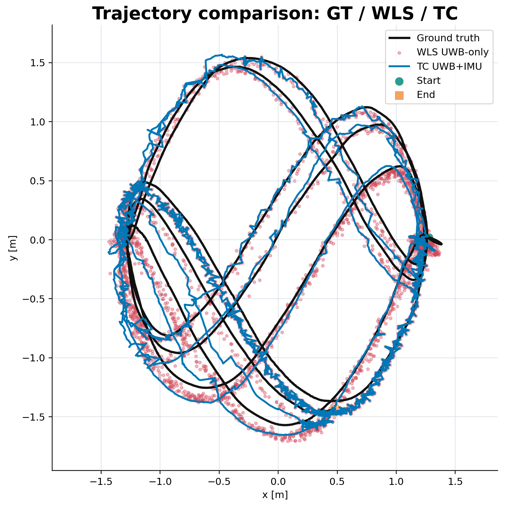
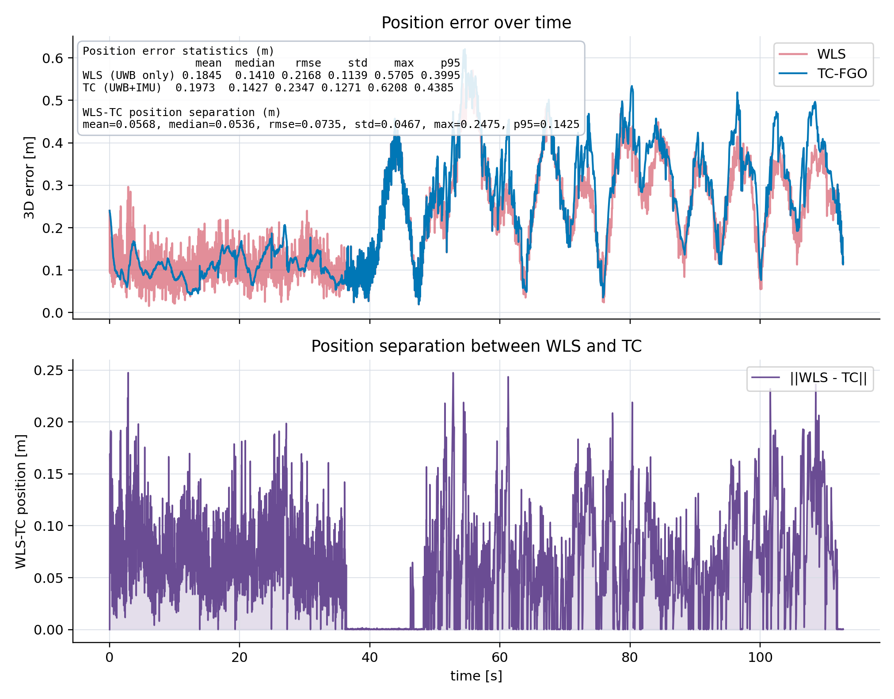
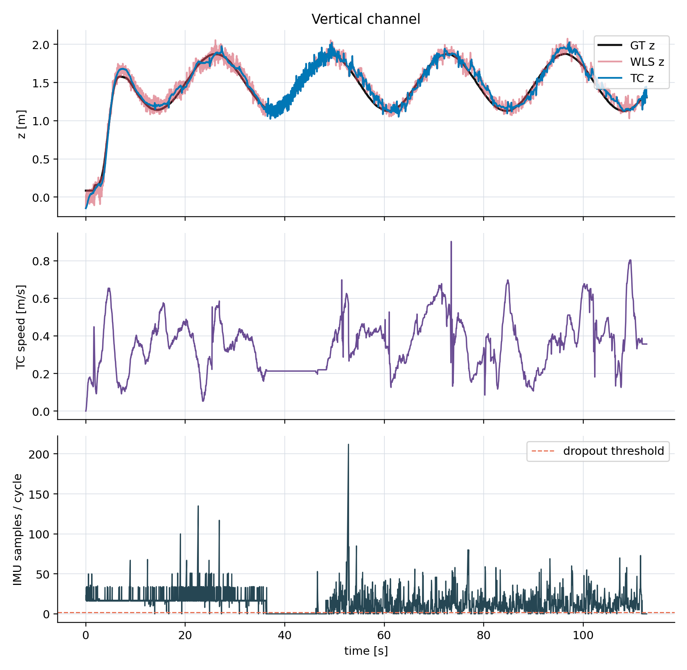
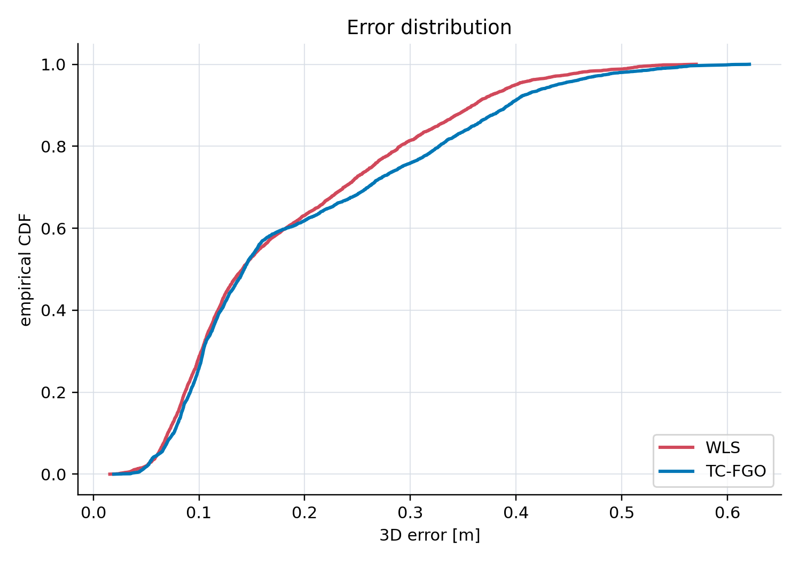
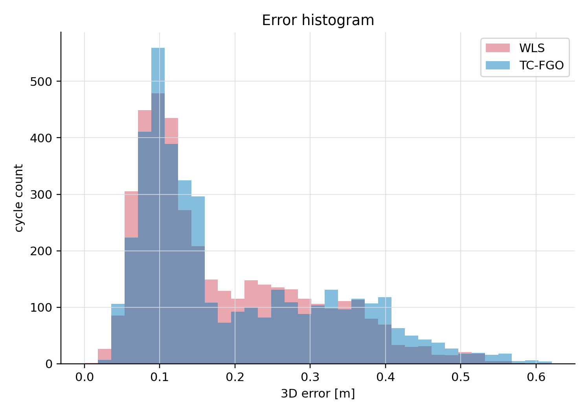
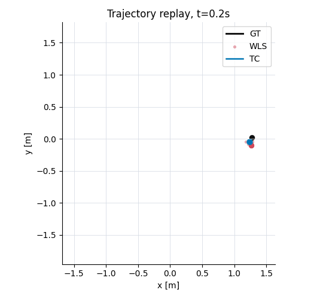
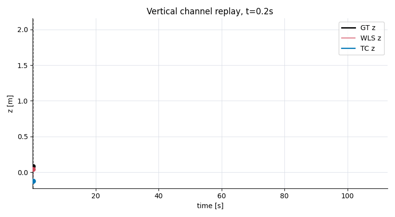

# 260429 UWB-IMU Fusion Report

Input CSV: `output/uwb_imu_trajectory_tc_260429.csv`

This report summarizes the new run generated from the `uwb_imu_fusion.launch` baseline after adding the TC attitude prior and WLS rescue prior. All figures and GIF animations referenced below are stored in this same `report/260429` folder.

## Position Error Statistics

| Estimator | Mean (m) | Median (m) | RMSE (m) | Std (m) | Max (m) | P95 (m) |
|---|---:|---:|---:|---:|---:|---:|
| WLS (UWB only) | 0.1845 | 0.1410 | 0.2168 | 0.1139 | 0.5705 | 0.3995 |
| TC (UWB+IMU) | 0.1973 | 0.1427 | 0.2347 | 0.1271 | 0.6208 | 0.4385 |

Dataset summary:

- Cycles: `4075`
- Duration: `112.725 s`
- TC lower-error cycles: `39.7%`
- Low-IMU cycles: `973`, or `23.9%`
- Mean absolute Z error: WLS `0.0578 m`, TC `0.0494 m`

The main result is mixed: WLS remains better in overall 3D RMSE, while TC improves the vertical channel and provides the full fused state: pose, velocity, attitude, and bias.

## WLS-TC Separation

The lower subplot of `error_timeseries.png` now shows direct 3D position separation:

```text
||p_wls - p_tc||
```

WLS-TC separation statistics:

| Metric | Value (m) |
|---|---:|
| Mean | 0.0568 |
| Median | 0.0536 |
| RMSE | 0.0735 |
| Std | 0.0467 |
| Max | 0.2475 |
| P95 | 0.1425 |

## Time-Segment Summary

| Segment | Time Range (s) | WLS RMSE | TC RMSE | TC Better Cycles |
|---|---:|---:|---:|---:|
| Q1 | 0.02-18.04 | 0.113 | 0.106 | 53.2% |
| Q2 | 18.07-38.29 | 0.111 | 0.119 | 40.7% |
| Q3 | 38.30-63.00 | 0.278 | 0.298 | 37.2% |
| Q4 | 63.05-112.75 | 0.293 | 0.326 | 27.5% |

The previous early TC divergence is controlled: TC is slightly better than WLS in the first quarter. Later sections still favor WLS horizontally.

## Figures

### Trajectory XY

Square-layout trajectory plot with ground truth, WLS, and TC:



### Position Error Over Time

Top: WLS and TC 3D error relative to ground truth. Bottom: direct WLS-TC 3D position separation.



### State Diagnostics

Vertical channel, TC speed, and IMU samples per cycle.



### Error Distribution





## Animations

### Trajectory Replay

Animated XY replay with ground truth, WLS, and TC:



### Vertical Channel Replay

Animated version of the vertical-channel subplot from `state_diagnostics.png`:



## Interpretation

The new strong constraints successfully prevent the earlier large TC attitude/velocity transient. This is visible in Q1, where TC RMSE is slightly lower than WLS. Over the full run, however, WLS still has lower 3D RMSE because TC carries more horizontal error in later trajectory sections.

The TC estimator is still valuable because it stabilizes Z, gives a continuous fused state, and behaves safely during low-IMU periods. For pure position accuracy on this dataset, WLS is the stronger baseline; for full navigation state output and vertical stability, TC remains useful.

## Regeneration Commands

Generate report figures and metrics:

```bash
./report/generate_report_assets.py \
  --csv output/uwb_imu_trajectory_tc_260429.csv \
  --out-dir report/260429
```

Generate square trajectory plot and trajectory replay GIF:

```bash
./report/generate_trajectory_visuals.py \
  --csv output/uwb_imu_trajectory_tc_260429.csv \
  --out-dir report/260429 \
  --frames 90
```

Generate vertical-channel GIF:

```bash
./report/generate_vertical_channel_gif.py \
  --csv output/uwb_imu_trajectory_tc_260429.csv \
  --out report/260429/vertical_channel_replay.gif \
  --frames 100
```

## Files

- `technical_report_260429.md`: this Markdown report.
- `technical_report_260429.tex`: LaTeX report source.
- `metrics.json`: exact metrics.
- `metrics_table.tex`: LaTeX metrics table.
- `trajectory_xy.png`: square-layout trajectory plot.
- `trajectory_replay.gif`: animated XY trajectory replay.
- `vertical_channel_replay.gif`: animated vertical-channel replay.
- `error_timeseries.png`: error and WLS-TC separation plot.
- `state_diagnostics.png`: vertical, speed, and IMU diagnostics.
- `error_cdf.png`, `error_histogram.png`: error distribution plots.
