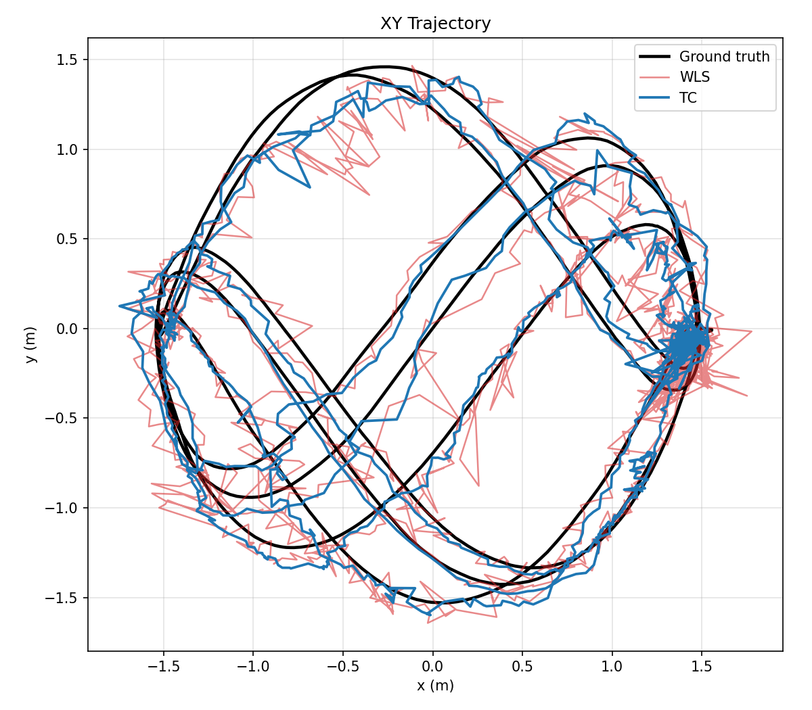
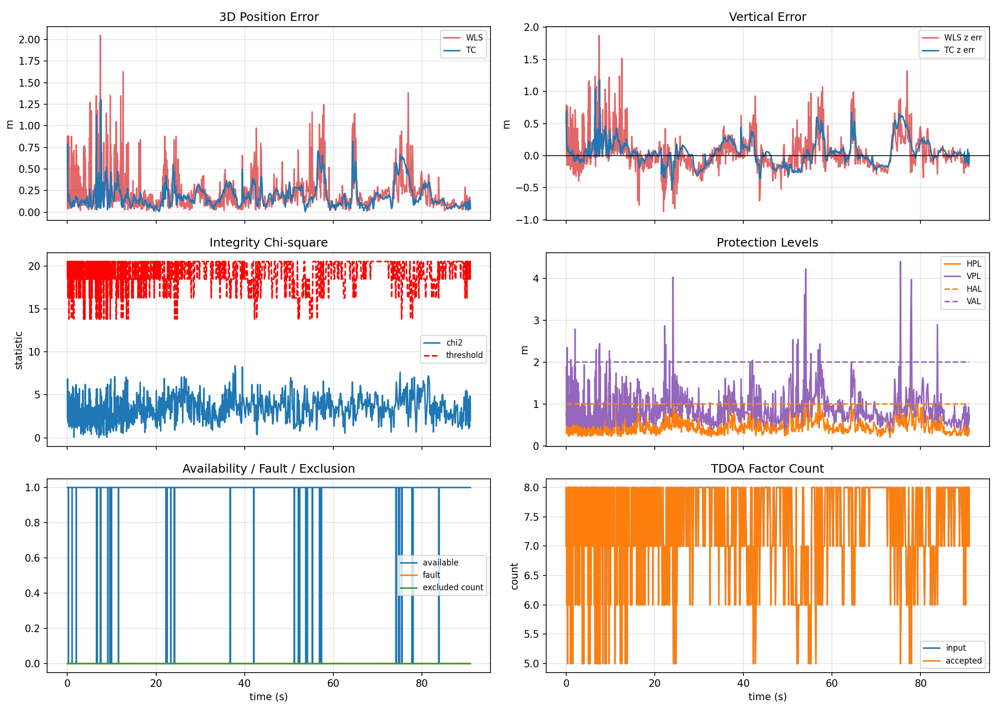
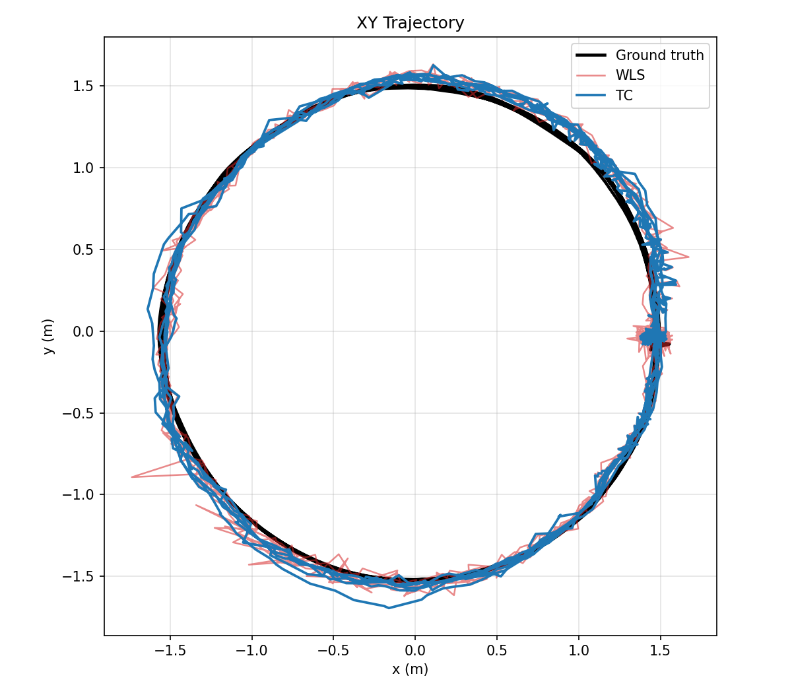
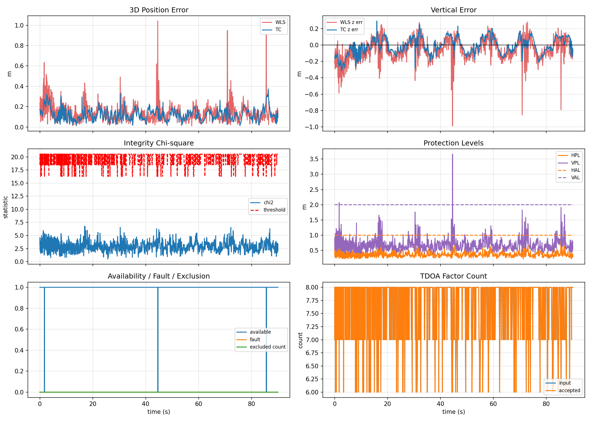

# Tightly-Coupled UWB/IMU Fusion with Integrity Monitoring — Technical Report

Source: [`src/uwb_imu_tc_integrity_node.cpp`](../src/uwb_imu_tc_integrity_node.cpp),
[`include/integrity_monitor.h`](../include/integrity_monitor.h),
[`include/integrity_tdoa_factor.h`](../include/integrity_tdoa_factor.h)

Datasets: [`integrity_final_2026-05-13`](integrity_final_2026-05-13/),
[`integrity_final_2026-05-14`](integrity_final_2026-05-14/)

---

## 1. Overview

The node estimates the position of a UWB-tracked platform by fusing **TDOA
range-difference measurements** with **inertial (IMU) data** in a single
factor-graph optimisation. It runs two estimators in parallel from the same
measurement stream:

- **WLS (UWB only)** — a weighted least-squares TDOA multilateration solution,
  used both as a baseline and as a prior source for the fused estimator.
- **TC (UWB + IMU)** — a *tightly coupled* fixed-lag factor-graph optimiser
  (GTSAM ISAM2) that ingests raw TDOA geometry as individual factors alongside
  IMU pre-integration factors.

The distinguishing feature is that UWB factors are **integrity-shaped**: a
RAIM-style monitor runs every UWB cycle and decides, per measurement, whether
each TDOA observation is healthy, suspicious, or faulty before it ever reaches
the graph.

```
UWB stream → cycle accumulator
                 ├─► WLS solver ─────────────────────────► uwb_wls / uwb_wls_path
                 └─► TC-FGO (IntegrityTdoaFactor × N
                            + ImuFactor + BiasBetween) ───► tc_fusion / tc_fusion_path
IMU stream → imu_buf_ (unit-converted, buffered)
```

---

## 2. Measurement Front-End

### 2.1 UWB cycle accumulator

TDOA messages arrive as anchor-pair range differences. They are grouped into
**cycles** ([`uwbCallback`](../src/uwb_imu_tc_integrity_node.cpp#L895)). A cycle
closes when any of the following occurs:

- `measurements_per_cycle_` (default 8) measurements have been collected;
- a duplicate anchor pair appears (start of a new sweep);
- `cycle_timeout_` (0.1 s) elapses since the cycle's first measurement.

Short cycles below `min_cycle_measurements_` (6) are dropped. Each completed
cycle is the atomic unit for WLS, integrity, and one TC keyframe.

### 2.2 IMU conditioning

IMU samples are converted to SI units on arrival
([`imuCallback`](../src/uwb_imu_tc_integrity_node.cpp#L783)):

- Accelerometer is published in **g**; `accel_scale_ = gravity_magnitude`
  converts to m/s².
- Gyroscope is published in **deg/s**; converted to rad/s.
- A one-shot sanity check over the first 200 samples flags a unit mismatch
  (raw gyro norm > 5 rad/s is physically impossible and indicates a missed
  deg→rad conversion — a silent 57× error).

Initial roll/pitch are estimated by gravity alignment over the first
`initial_alignment_imu_samples_` (100) static samples.

---

## 3. WLS Estimator

For each cycle, `solveDynamicWls` runs an unweighted TDOA least-squares solve,
then computes **dynamic per-measurement sigmas** from the post-fit residuals:

```
sigma_i = clamp( tdoa_sigma_min + residual_scale · |r_i|,  [sigma_min, sigma_max] )
```

and optionally re-solves the weighted problem, so multipath/NLOS-affected
measurements are automatically de-weighted. The WLS solution serves three roles:
a published baseline, the linearisation seed for the integrity monitor, and the
prior source feeding the TC graph.

---

## 4. Integrity Monitor (RAIM)

`TdoaIntegrityMonitor::check()` runs every cycle and produces an
`IntegrityResult` ([`integrity_monitor.h`](../include/integrity_monitor.h)).

### 4.1 Correlated covariance model

TDOA measurements that share an anchor are statistically correlated. When
per-anchor sigmas are supplied, the monitor builds the **full correlated
covariance**:

```
C = D · diag(σ_anchor²) · Dᵀ ,   D[i,k] ∈ {+1, −1, 0}
```

where row `i` of `D` encodes the directed anchor pair of measurement `i`. The
weight matrix is `W = C⁻¹`. A diagonal fallback exists for backward
compatibility but, as documented in the header, systematically under-detects
faults (observed 0 % fault rate on a 4125-epoch dataset).

### 4.2 Tests performed

| Test | Statistic | Decision |
|------|-----------|----------|
| **Chi-squared global test** | `T = rᵀ W r ~ χ²(M−3)` | fault if `T > χ²_threshold(1−p_fa)` |
| **Ring-closure test** | for every triple `(a,b,c)`: `TDOA(a→b)+TDOA(b→c)+TDOA(c→a)` should be 0 | `ring_ok` false if worst loop error > `ring_threshold` |
| **FDE** | leave-one-out subset χ² | excludes measurement giving lowest subset χ² if it passes `χ²(dof−1)` |
| **Protection levels** | `HPL = k_hpl·σ_major` (+ ARAIM slope term), `VPL` similarly | `available` if `HPL < HAL` and `VPL < VAL` |

`HPL` uses the **major-axis eigenvalue** of the 2×2 horizontal covariance
sub-matrix, correctly accounting for cross-correlation `P01` — the previous
`sqrt(P00+P11)` form gave falsely optimistic availability.

---

## 5. Integrity-Shaped Tight Coupling

This is the core of the node. The integrity result does **not** modify the TDOA
residual itself; instead it shapes *which* measurements enter the graph and
*how much* they are trusted ([`applyTcIntegrityMonitoring`](../src/uwb_imu_tc_integrity_node.cpp#L1027)).

For each cycle, the standardized residual `|r_i/σ_i|` of every measurement
determines its treatment:

| Condition | Action | Factor label |
|-----------|--------|--------------|
| `\|std_resid\| ≤ soft_gate` (2.5) | nominal/dynamic sigma kept | `nominal` |
| `soft_gate < \|std_resid\| ≤ hard_gate` | sigma inflated by up to `sigma_inflation` (4×) | `inflated` |
| `\|std_resid\| > hard_gate` (5.0) | measurement excluded from graph | dropped |
| FDE-selected fault | measurement excluded from graph | dropped |
| `available == false` (HPL/VPL exceed limits) | all sigmas inflated by HPL/HAL ratio | `unavailable` |

A hard floor (`tc_integrity_min_factors_`, default 4) guarantees the graph never
loses geometric observability — exclusions stop once that count is reached.

The surviving measurements become `IntegrityTdoaFactor`s
([`integrity_tdoa_factor.h`](../include/integrity_tdoa_factor.h)). The factor
residual is the raw TDOA geometry `(distA − distB) − measured`, with the noise
model already shaped by the monitor; integrity metadata (sigma, std-resid,
label) is carried for log auditing.

### 5.1 NLOS anchor rejection

`selectCleanLosMeasurements` performs a coarser, anchor-level test: if the
all-anchor solution fails integrity, it tries dropping each anchor in turn,
re-solving WLS, and keeps the "clean LOS" subset only if it materially improves
the integrity score (HPL/VPL or χ²) without shifting the position implausibly.

### 5.2 The TC factor graph

Per keyframe `k` ([`tcUpdateGraph`](../src/uwb_imu_tc_integrity_node.cpp#L2021)):

- **`ImuFactor`** — GTSAM pre-integration of IMU samples over the cycle window.
- **`BetweenFactor` on bias** — random-walk constraint linking `B(k−1)→B(k)`.
- **`IntegrityTdoaFactor × N`** — one per accepted, integrity-shaped TDOA.
- **WLS position prior** — tight in XY (0.10 m), looser in Z (0.18 m), gated
  by an innovation test; a "rescue" prior tightens it if TC drifts too far.
- **Attitude prior** — pins roll/pitch (TDOA is translation-only, so roll/pitch
  are weakly observable; yaw is left free).
- **Vertical / velocity priors** — stabilise the weakly-observed Z and velocity.

A dedicated **dropout handler** (`tcDropoutUpdate`) runs when fewer than
`min_imu_per_cycle_` IMU samples exist for a cycle: it adds no `ImuFactor`,
instead anchoring position to WLS and applying a tight velocity prior to kill
the phantom drift (~0.8 m per 0.6 s gap) that frozen velocity would integrate.

---

## 6. Results

Metrics are absolute position error vs. ground truth, from
`summary_metrics.csv` in each dataset folder.

### 6.1 Dataset 2026-05-14

| Estimator | Mean | Median | RMSE | Std | Max | P95 |
|-----------|------|--------|------|-----|-----|-----|
| WLS (UWB only) | 0.240 | 0.161 | 0.340 | 0.241 | 2.045 | 0.770 |
| **TC (UWB+IMU)** | **0.180** | **0.145** | **0.221** | **0.127** | **1.301** | **0.445** |
| Improvement | −25 % | −10 % | **−35 %** | −47 % | −36 % | **−42 %** |

Per-axis RMSE: X 0.106→0.080 (−25 %), Y 0.120→0.085 (−29 %),
Z 0.300→0.187 (−38 %).

### 6.2 Dataset 2026-05-13

| Estimator | Mean | Median | RMSE | Std | Max | P95 |
|-----------|------|--------|------|-----|-----|-----|
| WLS (UWB only) | 0.149 | 0.129 | 0.175 | 0.092 | 1.042 | 0.332 |
| **TC (UWB+IMU)** | **0.131** | **0.123** | **0.145** | **0.062** | **0.375** | **0.254** |
| Improvement | −12 % | −5 % | **−18 %** | −33 % | **−64 %** | −23 % |

Per-axis RMSE: X 0.049→0.062, Y 0.053→0.053, Z 0.160→0.119 (−26 %).

### 6.3 Discussion

- **Tail behaviour is where tight coupling pays off.** The max error drops from
  2.04 m → 1.30 m (05-14) and 1.04 m → 0.38 m (05-13), and P95 improves
  23–42 %. The IMU pre-integration plus integrity gating absorb the large WLS
  spikes caused by NLOS/multipath that the chi-squared and std-residual gates
  identify and either de-weight or exclude.
- **The error standard deviation falls by ~33–47 %**, i.e. the fused trajectory
  is markedly smoother — the dominant qualitative benefit of adding the IMU.
- **Vertical channel gains most.** Z RMSE improves 26–38 %; UWB anchor geometry
  is weak vertically, so the IMU and vertical prior contribute strongly.
- On the already-clean 05-13 set the X axis RMSE is marginally worse
  (0.049→0.062 m, ~13 mm) — when WLS is near its noise floor the IMU and priors
  add a small amount of correlated error, an acceptable trade for the large
  tail-error reduction.

---

## 7. Figures

### 7.1 Dataset 2026-05-14

| Figure | File |
|--------|------|
| XY trajectory (GT vs WLS vs TC) | [xy_trajectory.png](integrity_final_2026-05-14/figures/xy_trajectory.png) |
| Position error & integrity timeline | [error_and_integrity.png](integrity_final_2026-05-14/figures/error_and_integrity.png) |
| XY trajectory (animated) | [xy_trajectory.gif](integrity_final_2026-05-14/figures/xy_trajectory.gif) |
| Position error (animated) | [position_error.gif](integrity_final_2026-05-14/figures/position_error.gif) |
| Z trajectory error (animated) | [z_trajectory_error.gif](integrity_final_2026-05-14/figures/z_trajectory_error.gif) |
| Integrity diagnostics (animated) | [integrity_diagnostics.gif](integrity_final_2026-05-14/figures/integrity_diagnostics.gif) |





### 7.2 Dataset 2026-05-13

| Figure | File |
|--------|------|
| XY trajectory (GT vs WLS vs TC) | [xy_trajectory.png](integrity_final_2026-05-13/figures/xy_trajectory.png) |
| Position error & integrity timeline | [error_and_integrity.png](integrity_final_2026-05-13/figures/error_and_integrity.png) |
| XY trajectory (animated) | [xy_trajectory.gif](integrity_final_2026-05-13/figures/xy_trajectory.gif) |
| Position error (animated) | [position_error.gif](integrity_final_2026-05-13/figures/position_error.gif) |
| Z trajectory error (animated) | [z_trajectory_error.gif](integrity_final_2026-05-13/figures/z_trajectory_error.gif) |
| Integrity diagnostics (animated) | [integrity_diagnostics.gif](integrity_final_2026-05-13/figures/integrity_diagnostics.gif) |





---

## 8. Conclusion

The node implements a tightly-coupled UWB/IMU factor-graph estimator in which
every UWB measurement passes through a RAIM-style integrity monitor before
graph insertion. Faulty measurements are excluded, suspicious ones have their
noise inflated, and an "unavailable" verdict softens all UWB factors — while a
minimum-factor floor preserves observability. Across both datasets the fused
estimator reduces RMSE by 18–35 %, P95 error by 23–42 %, worst-case error by
36–64 %, and error standard deviation by 33–47 % relative to the UWB-only WLS
baseline, with the vertical channel and the error tail benefiting most.
